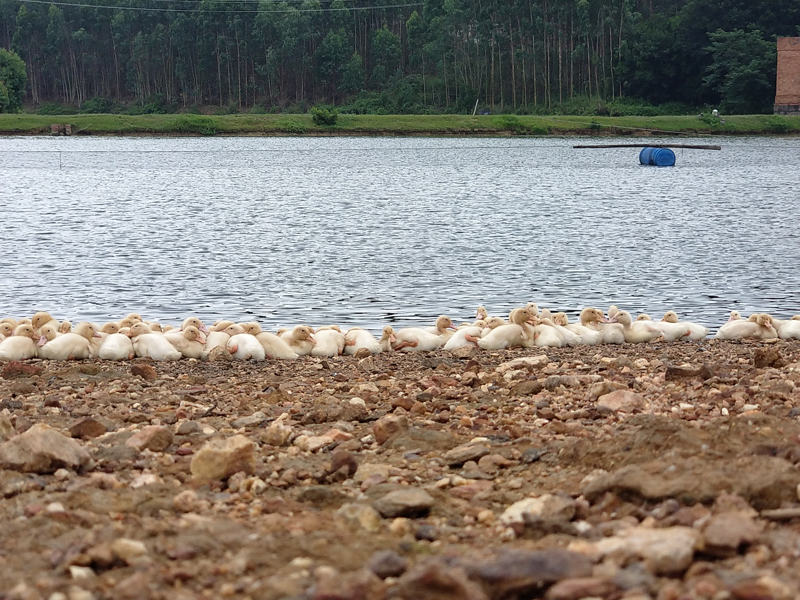

# QG官网

### 1.总体设计（需要管理端）

**常规栏目**：

- 工作室的介绍
- 指导老师的介绍
- 成员（现有及往届成员）的介绍
- 成果介绍（可以是获奖、软著、专利）
- 组别介绍

**专栏**：

- QG特色：训练营、暑假培训营、康乐活动、技术交流会（包括往届师兄实习回来分享经验）、毕业生活动。
- QG发展事件：以时间为轴，介绍QG从05年到现在的一些事件，比如刷新获奖记录、每年招新情况等等
- 博客：往届师兄可以在上面发表心得体会，师兄可以将自己的博客放到这个博客中，然后可供QGer进行学习，我觉得后者的作用会大一点

**设计要求**：

- 页面不要太过于纵向化也不要过于扁平化。即查看某个内容的时候点击次数不要过多，也要有一些内容的分类。
- 可参考国外的一些优秀团队的官网设计
- 风格：偏严谨风格，但是要有一些qg特色在里面，整体设计可以偏向文艺一点（参考中大、暨大的一些网站），不要太直，内容的话如果能润色一下会更好（比较难）。
- 重点：国际化（中英切换），可以想一下宣传主流价值观。
- 架构偏向弹性，后期可进行添加东西。

**参考资料**：

- 教六宣传板块
- 工作室资料

### 2.时间安排

- 初版：5月20日完成。
- 终版：这个学期完成。

